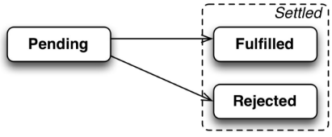
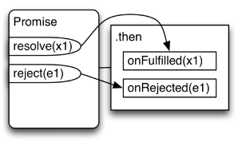

<!-- $theme: default -->

<!-- $height: 1000px-->
<!-- page_number: true -->
# About ES6 Promises
Valverde Antonio

---

# Summary
- Why Promises?
- What is a Promise?
- Promise standard
- Producing a Promise
- Consuming a Promise
- Instance methods
  - then()
  - catch()
- Static methods
  - Promise.all()
  - Promise.race()
  - Promise.resolve()
  - Promise.reject()
- Promise limitations
- Compatibility Promises/callbacks in libraries
- Quizes
- References 

---

# Why Promises?

---

# Why Promises?

## Hadoken code


---

# Why Promises? 
## Compared to callback:

- Chaining is simpler
- Promise-based functions return results, they don’t continue execution via callbacks
  - The caller stays in control 
- Cleaner signatures
    - With callbacks, the parameters of a function are mixed. With Promises all parameters are input 
- Standardized
  - Before promises: Node.js callbacks, XMLHttpRequest, IndexedDB, etc

---

# Why Promises?
# One more reason: Trust

---
# Why Promises?
## Problems with callbacks

  1) Call the callback more than once
  2) Call the callback too early
  3) Don’t call the callback
  4) Errors could create a synchronous reaction whereas nonerrors would be asynchronous

<br>
This makes callbacks not very trustable in some cases.

---

# Why Promises?
## 1) Call the callback more than once

→ Promises are resolved only once by definition

---

# Why Promises?
## 2) Call the callback too early

→ The callback you provide to Promise instances then(..) method will always be called asynchronously

---

# Why Promises?
## 3) Don’t call the callback

→ A timeout can be set using Promise.race(..)

---

# Why Promises?
## 4) Errors could create a synchronous reaction whereas nonerrors would be asynchronous

→ Promises turn even JS exceptions (synchronous) into asynchronous behavior

---

# What Is a Promise?

---

# What Is a Promise?

## A promise is a future value

---

# Promise states
## A Promise is always in one of three mutually exclusive states:
- Before the result is ready, the Promise is `pending`
- If a result is available, the Promise is `fulfilled`
- If an error happened, the Promise is `rejected`

    


---

# Promise standard

## `Promises/A+`
https://promisesaplus.com/
<br>

From now on I will speak about ES6 Native promises.

---
# Promise standard

## Famous Promise libraries

`bluebird` 
https://github.com/petkaantonov/bluebird

`Q` 
https://github.com/kriskowal/q

---

# Producing a Promise

```js
const p = new Promise(
    function (resolve, reject) { // (A)
        ···
        if (···) {
            resolve(value); // success
        } else {
            reject(reason); // failure
        }
    });
```

---
# Consuming a Promise
## Super rough basic usage

```js
const promise = returnPromise();

promise.then( 
  function fulfilled (result) {
    console.log(result);
  },
  function rejected () {
    // handle rejected promise  
  }
);
```

---

# Instance methods

## `then()`

Accepts two callbacks parameters
- First parameter: called in case of resolve
- Second parameter: called in case of rejection

    

→ In case something different from a function is passed as parameter, that `then()` is ignored and the Promise chain continues.

---

# Instance methods: `then()`

### Always return a promise

```js
const p = Promise.resolve(3)
  .then(x => {})
  .then(x => {
    console.log(x);
  });


p instanceof Promise // true
```

---

# Instance methods: `then()`

### Always return a promise
#### → Return an empty resolved promise if there is no return
```js
Promise.resolve(3)
  .then(x => {})
  .then(x => {
    console.log(x);
  });
```

---

# Instance methods: `then()`

### Always return a promise
#### → If a normal result is returned, it is returned as a resolved promise
```js
Promise.resolve(3)
  .then(x => {
    return 4;
  })
  .then(x => {
    console.log(x); // 4
  });
```
```js
// same as code above
const p = Promise.resolve(3)
  .then(x => {
    return 4;
  });

// p contains a resolved promise with the value 4

p.then(x => {
  console.log(x); // 4
});
```

---

# Instance methods: `then()`

### Always return a promise
#### → A fulfilled or rejected promise can be returned as well
```js
Promise.resolve(3)
  .then(x => {
    return Promise.resolve(4);
  })
  .then(x => {
    console.log(x);
  });


Promise.resolve(3)
  .then(x => {
    return Promise.reject('ooops');
  })
  .then(x => {
    console.log(x);
  })
  .catch(e => {
    console.log(e);
  });
```

---

# Instance methods: `then()`

### Always return a promise
#### → if an exception is thrown returns a rejected promise with the value
```js
Promise.resolve(3)
  .then(x => {
    throw new Error(‘omg’);
    return 4;
  })
  .then(
    x => {
     console.log(x);
    },
    e => {
     console.log(e);
    }
  );
```

---

# Instance methods

## `catch()`

### `catch()` is simply a more convenient alternative to calling `then()`

```js
promise.then(
    null,
    error => { /* rejection */ }
);
```
Above code is the same as the code below:
```js
promise.catch(error => { 
  /* rejection */ 
});
```

---

# Instance methods
## `done()` ?

`done()` is implemented in some libraries, but not in ES6 Promises at the moment.

---

# Static methods

## `Promise.all()`

Accepts an iterable as parameter.

Returns a Promise that:
- Is fulfilled if all elements in iterable are fulfilled
   - Fulfillment value: Array with fulfillment values
- Is rejected if any of the elements are rejected
   - Rejection value: first rejection value

---

# Static methods: `Promise.all()`

```js
Promise.all([
    asyncFunc1(),
    asyncFunc2()
  ])
  .then((results) => {
    ···
  })
  .catch(err => {
    // Receives first rejection among the Promises
    ···
  });
```

---

# Static methods: `Promise.all()`

Native `Array.prototype.map()` can be used:

```js
const fileUrls = [
    'http://example.com/file1.txt',
    'http://example.com/file2.txt',
];

const promisedTexts = fileUrls.map(httpGet);

Promise.all(promisedTexts)
  .then(texts => {
    for (const text of texts) {
      console.log(text);
    }
  })
  .catch(reason => {
    // Receives first rejection among the Promises
  });
```

---

# Static methods

## `Promise.race()`

Accepts an iterable as parameter.

The first element of iterable that is settled is used to settle the returned Promise.

```js
Promise.race([
    httpGet('http://example.com/file.txt'),
    delay(5000).then(function () {
      throw new Error('Timed out')
    });
  ])
  .then(text => {
  ...
  })
  .catch(reason => {
    // Receives first rejection among the Promises
  });
```

---

# Static methods

## `Promise.resolve(x)`

### Returns a Promise that is fulfilled with `x`.
### `x` can be:
- Value
- Promise
- Thenable

---

# Static methods: `Promise.resolve(x)`

If `x` is a value:

```js
 Promise.resolve('abc')
   .then(x => console.log(x)); // abc
```
 
---

# Static methods: `Promise.resolve(x)`

If `x` is a Promise whose constructor is the receiver then x is returned unchanged:

```js
const p = new Promise(() => null);

console.log(Promise.resolve(p) === p); // true
```

---

# Static methods: `Promise.resolve(x)`

If `x` is a `thenable`, it is converted to a Promise.


→ *A `thenable` is an object that has a Promise-style then() method.*

---

# Static methods: `Promise.resolve(x)`

`Promise.resolve(x)` makes sure we get a Promise result, so we can get a normalized, safe result we'd expect.

---

# Static methods: `Promise.reject(err)`

Returns a Promise that is rejected with err:

```js
const myError = new Error('Problem!');
Promise.reject(myError)
  .catch(err => console.log(err === myError)); // true
```
<br>

In the code below `p1` and `p2` have a rejected promise with the reason `'Ooops'`.

```js
var p1 = new Promise( function(resolve,reject){
    reject('Oops');
} );

var p2 = Promise.reject('Oops');
```

---

# Promise limitations

## Sequence error handling

```js
// `foo(..)`, `STEP2(..)` and `STEP3(..)` are
// all promise-aware utilities

var p = foo( 42 )
  .then( STEP2 )
  .then( STEP3 );

p.catch( handleErrors );
```
<br>

If any step of the chain in fact does its own error handling (perhaps hidden/abstracted away from what you can see), `handleErrors(..)` won't be notified.

---

# Promise limitations

## Single value

Promises by definition only have a single fulfillment value or a single rejection reason.

```js
Promise.resolve(3)
  .then(x => {
    return [1, 2];
  })
  .then( function(msgs){
    const x = msgs[0];
    const y = msgs[1];

    console.log( x, y );
  });
```
```js
Promise.resolve(3)
  .then(x => {
    return { a: 1, b: 2 };
  })
  .then(x => {
    const a = x.a;
    const b = x.b;
    console.log(a, b);
  });
```

---

# Promise limitations

## Single value

Using ES6 destructuring we can avoid some boilerplate :

```js
Promise.resolve(3)
  .then(x => {
    return [1, 2];
  })
  .then(([x, y]) => {
    console.log(x, y);
  });
```
```js
Promise.resolve(3)
  .then(x => {
     return { a: 1, b: 2 };
  })
  .then(({ a, b }) => {
    console.log(a, b);
  });
```

---

# Promise limitations

## Promise uncancelable

Once you create a Promise and register a fulfillment and/or rejection handler for it, there's nothing external you can do to stop that progression.

---

# Compatibility Promises/callbacks in libraries

## Many libraries have implemented compatibility with both Promises and callbacks.

As a convention, usually a Promise is returned if no callback is passed.

---

# Compatibility Promises/callbacks in libraries

## Example: Node.js MongoDB Driver API

```js
collection.find().toArray((err, docs) => {
  if (err) {
    // err handling
  }
  console.log(docs):
});
```
```js
collection.find().toArray().then(
    docs => { console.log(docs); },
    err => { // err handling }
  );
```

---

# Quizes
## Log Order?

```js
const p = Promise.resolve()


p.then( function a() {
    p.then( function c() {
        console.log('C');
    } );
    console.log('A');
} );


console.log('D');


p.then( function b() {
    console.log('B');
} );


console.log('F');
```

--- 

# Quizes
## What is logged? (Part 1)

```js
const doSomethingElse = () => {
  return Promise.resolve('hola');
};

const finalHandler = (message) => {
  console.log(message);
};
```

```js
Promise.resolve()
  .then(() => {
    return doSomethingElse();
  })
  .then(finalHandler);
```

--- 

# Quizes
## What is logged? (Part 2)

```js
const doSomethingElse = () => {
  return Promise.resolve('hola');
};

const finalHandler = (message) => {
  console.log(message);
};
```

```js
Promise.resolve()
  .then(() => {
    doSomethingElse();
  })
  .then(finalHandler);
```

--- 

# Quizes
## What is logged? (Part 3)

```js
const doSomethingElse = () => {
  return Promise.resolve('hola');
};

const finalHandler = (message) => {
  console.log(message);
};
```

```js
Promise.resolve()
  .then(doSomethingElse())
  .then(finalHandler);
```

--- 

# Quizes
## What is logged? (Part 4)

```js
const doSomethingElse = () => {
  return Promise.resolve('hola');
};

const finalHandler = (message) => {
  console.log(message);
};
```

```js
Promise.resolve()
  .then(doSomethingElse)
  .then(finalHandler);
```

--- 

# Quizes
## What is the difference?

```js
Promise.resolve('hola')
  .then(
    function fulfilled (msg) {
      msg.type.error;
      console.log(msg);
    },
    function rejected (err) {
      console.log('caught error:', err);
    }
  );
```
```js
Promise.resolve('hola')
  .then(function fulfilled (msg) {
    msg.type.error;
    console.log(msg);
  })
  .catch(function rejected (err) {
    console.log('caught error:', err);
  });
```

---

# Sources

- You Don't Know JS: Async & Performance (Kyle Simpson)
https://github.com/getify/You-Dont-Know-JS/blob/master/async%20%26%20performance/ch3.md

- Exploring ES6 (Axel Rauschmayer)
http://exploringjs.com/es6/ch_promises.html

- pouchdb blog: We have a problem with promises (Nolan Lawson)
https://pouchdb.com/2015/05/18/we-have-a-problem-with-promises.html

- JavaScript reference documentation 
https://developer.mozilla.org/en/docs/Web/JavaScript/Reference/Global_Objects/Promise

---

# >　　　　　Thank you!
# >　　　　　